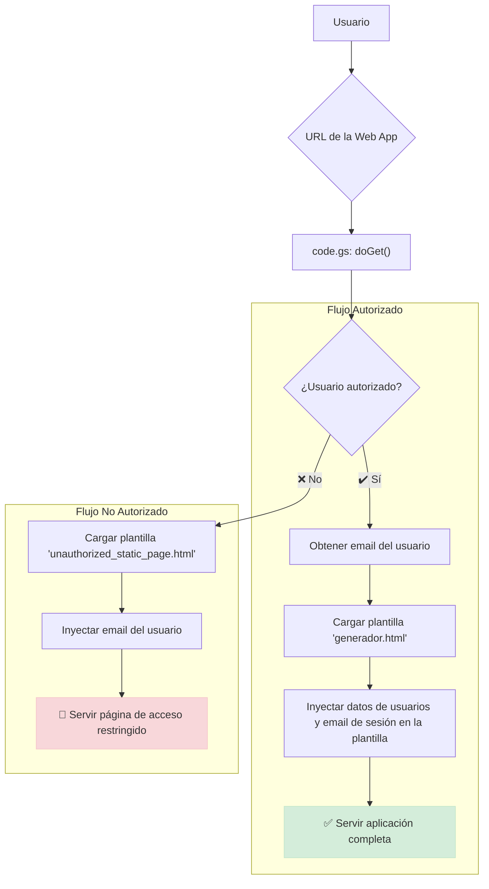

# Generador de emails de soporte

Este proyecto es una aplicación web creada con **Google Apps Script** diseñada para estandarizar y agilizar la redacción de correos electrónicos de soporte técnico con múltiples respuestas para el Vicerrectorado de Personal Docente e Investigador (SVICPDI) de la Universidad de La Laguna.

La herramienta permite construir un email complejo a partir de bloques dinámicos, previsualizar el resultado en tiempo real y copiarlo en formato visual (Rich Text) para pegarlo directamente en un cliente de correo.

## Características principales

- **Interfaz Dinámica**: Formulario web intuitivo para construir el cuerpo del correo.
- **Bloques de Respuesta Múltiples**: Permite añadir tantas respuestas como sean necesarias, cada una con la capacidad de citar el texto original del usuario para dar contexto.
- **Previsualización en Tiempo Real**: Muestra una vista previa del email con formato HTML a medida que se redacta.
- **Firma Automática**: Identifica al técnico que ha iniciado sesión y selecciona automáticamente su firma.
- **Control de Acceso**: Solo los usuarios autorizados (definidos en las propiedades del script) pueden utilizar la aplicación.
- **Doble Formato de Copiado**:
  - **Copia Visual**: Copia el contenido como texto enriquecido, listo para pegar en Gmail, Outlook, etc., conservando todo el formato.
  - **Copia HTML**: Para usuarios avanzados que necesiten el código HTML subyacente.

## Arquitectura y flujo de funcionamiento

La aplicación sigue un flujo sencillo gestionado por Google Apps Script, que actúa como backend y servidor web.

1.  El usuario accede a la URL de la aplicación web.
2.  `code.gs` intercepta la petición con la función `doGet()`.
3.  Se obtiene el email del usuario (`Session.getActiveUser().getEmail()`).
4.  Se comprueba si el email existe como clave en el objeto de la propiedad `AUTHORIZED_USERS_DATA`.
5.  - **Si está autorizado**: Se inyectan todos los datos de los usuarios autorizados en la plantilla `generador.html` y se pasa el email del usuario que ha iniciado sesión para que la interfaz se personalice automáticamente.
    - **Si no está autorizado**: Se muestra una página estática de acceso restringido (`unauthorized_static_page.html`).

A continuación se muestra un diagrama del flujo:



## Configuración

Para desplegar o modificar este proyecto, necesitas configurar las siguientes **Propiedades del Script** en el editor de Google Apps Script (`Configuración del proyecto` ⚙️ > `Propiedades de la secuencia de comandos`).

### 1. `AUTHORIZED_USERS_DATA`

- **Descripción**: Un único objeto JSON que define todos los usuarios autorizados y sus datos asociados. La clave de cada entrada es el **email del usuario**, y el valor es un objeto con su nombre completo (`fullName`) y una URL opcional (`url`) para la firma. Este objeto es la única fuente de verdad para la autorización y los datos de los técnicos.
- **Descripción**: Un único objeto JSON que define todos los usuarios autorizados y sus datos asociados. La clave de cada entrada es el **email del usuario**, y el valor es un objeto con su nombre completo (`fullName`) y una URL opcional (`url`) para la firma. Este objeto es la única fuente de verdad para la autorización y los datos de los técnicos. **Es fundamental que adapte el contenido de esta propiedad con los datos reales de los técnicos que utilizarán la herramienta.**
- **Ejemplo**:
  ```json
  {"usuario1@email.com": {"fullName": "Nombre y apellidos 1", "url": "https://example.com"}, "usuario2@email.com": {"fullName": "Nombre y apellidos 2", "url": ""}}
  ```

### 2. `ADMIN_EMAIL`

- **Descripción**: La dirección de correo del administrador que se mostrará en la página de "Acceso Restringido" para que los usuarios no autorizados puedan solicitar acceso.
- **Ejemplo**: `admin.soporte@email.com`

*Nota: Las propiedades `ALLOWED_USERS`, `USER_TO_TECH_MAP` y `TECHNICIANS_DATA` han sido reemplazadas por la propiedad unificada `AUTHORIZED_USERS_DATA`.*

## Despliegue

Para que la aplicación funcione correctamente, es **crucial** configurar la implementación de la aplicación web con los siguientes parámetros:

1.  Abre el proyecto en el editor de Google Apps Script.
2.  Haz clic en **Implementar > Nueva implementación**.
3.  En "Seleccionar tipo", elige **Aplicación web**.
4.  Configura lo siguiente:
    -   **Descripción**: Una descripción para esta versión (ej: "Versión inicial").
    -   **Ejecutar como**: **`Usuario que accede a la aplicación web`**. Este es el ajuste más importante. Si se deja como "Yo", la aplicación siempre se ejecutará con tu identidad y no podrá identificar al usuario que la visita.
    -   **Quién tiene acceso**: **`Cualquier usuario de la organización [Tu Dominio]`** (o "Cualquier persona con una cuenta de Google"). Esto obliga a los usuarios a iniciar sesión, permitiendo que el script obtenga su email. Si se elige "Cualquiera", los usuarios anónimos no podrán ser identificados.
5.  Haz clic en **Implementar**. Se generará una URL para acceder a la aplicación.

### Actualizar una Implementación Existente

Cada vez que haces una "Nueva implementación", se crea una URL **diferente**. Si quieres actualizar la aplicación en la misma URL, debes:

1.  Ir a **Implementar > Gestionar implementaciones**.
2.  Seleccionar tu implementación activa.
3.  Hacer clic en el icono del lápiz (✏️) para editarla.
4.  En el desplegable "Versión", elegir **Nueva versión**.
5.  Hacer clic en **Implementar**.

Para pruebas durante el desarrollo, es recomendable usar la **URL de la implementación de prueba**, ya que siempre refleja la última versión del código guardado.

## Solución de Problemas

### El email del usuario no aparece o la firma no se bloquea

Si la aplicación no identifica correctamente al usuario (la página de "Acceso Restringido" muestra "usuario (desconocido)" o el selector de firma no se bloquea para un usuario autorizado), el problema casi siempre se debe a una configuración incorrecta de la implementación.

**Verifica los siguientes puntos:**

1.  **"Ejecutar como"**: Asegúrate de que la implementación está configurada para ejecutarse como **`Usuario que accede a la aplicación web`**. Revísalo en **Implementar > Gestionar implementaciones**.
2.  **"Quién tiene acceso"**: Asegúrate de que el acceso está restringido a usuarios que deben iniciar sesión (ej: `Cualquier usuario de la organización`).
3.  **URL Correcta**: Asegúrate de que estás accediendo a la URL de la implementación correcta y no a una URL de una implementación antigua o de prueba.

Si cambiaste la configuración, debes crear una **nueva versión** de tu implementación existente para que los cambios surtan efecto en la URL de producción.

## Uso de la herramienta

1.  Accede a la URL de la aplicación web implementada.
2.  Introduce el nombre del destinatario en el campo "Destinatario".
3.  Selecciona el género para que el saludo ("Estimado/a") sea correcto.
4.  Por defecto, se crea un "Bloque #1".
    - **Citar texto (opcional)**: Pega aquí el fragmento del correo original al que vas a responder.
    - **Respuesta a este punto**: Escribe tu respuesta para ese bloque.
5.  Usa el botón **Añadir bloque** para crear más pares de cita/respuesta.
6.  Utiliza los botones de copiado en la parte inferior del panel de redacción para obtener el resultado final.